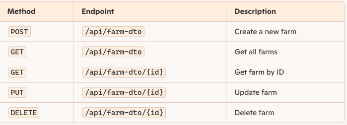
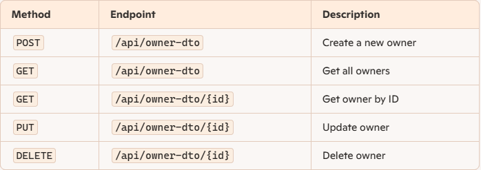
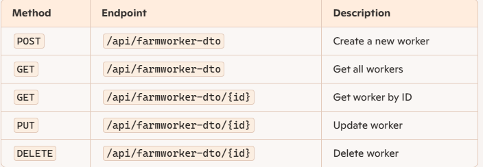
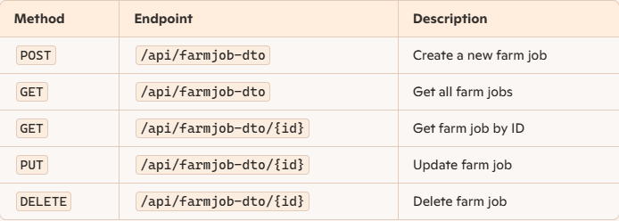

# 🌱 Farm Control API

## Project Description

This project is a **REST API** for  farms, owners, workers, and job assignments. It allows CRUD operations on farms and their related entities while ensuring proper data validation and business logic enforcement.

The API is built using **Spring Boot**, **Java**, and follows a microservices approach to ensure scalability.


## Class Diagram


## ⚙️ Setup
### ** Clone the Repository**
git clone https://github.com/JesusCiber/FarmControl

### ✅ Requirements
- Java 21
- Maven
- MySQL Server
- Postman or similar for testing the API


### Configure the Database
Modify `application.properties`

```properties
spring.datasource.url=jdbc:mysql://localhost:3306/"YOUR_DATABASE_NAME"
spring.datasource.username="your_username"
spring.datasource.password="your_password"
```

### 🛠 Technologies Used
#### - Java 21

#### - Spring Boot 3

#### - Spring Data JPA

#### - Spring Security (Pending Implementation)

#### - JUnit 5 & Mockito (for testing)

#### - MySQL (for persistence)


## 🛣 Controllers and Routes structure
### 📌 FarmController



### 📌 OwnerController



### 📌 FarmWorkerController



### 📌 FarmJobController




### 🔗 Extra links
- https://trello.com/invite/b/681a11e261f31492554bbb80/ATTIb2993179848a86818dfab45eaa2ff51d271BEBBF/farmcontrol
- https://docs.google.com/presentation/d/1ZT9yCUeY0hcL-Ds6z3GZyp0ncOYquGTEpUwNwGFN9rg/edit?usp=sharing

### 🔮 Future Work
#### 🚀 Planned features for future releases:

- **JWT (JSON Web Tokens)** → Secure user authentication without stateful sessions.
- **Role-Based Access Control (RBAC)** → `ADMIN`, `OWNER`, `WORKER` roles for controlled access.
- **BCrypt Password Encryption** → Secure user credentials storage.
- **Spring Security Filters** → API protection and request validation.


### 📚 Resources
- **[Spring Boot Documentation](https://spring.io/projects/spring-boot)** 
- **[JUnit 5 Testing Guide](https://junit.org/junit5/docs/current/user-guide/)**
- **[Mockito Documentation](https://site.mockito.org/)**
